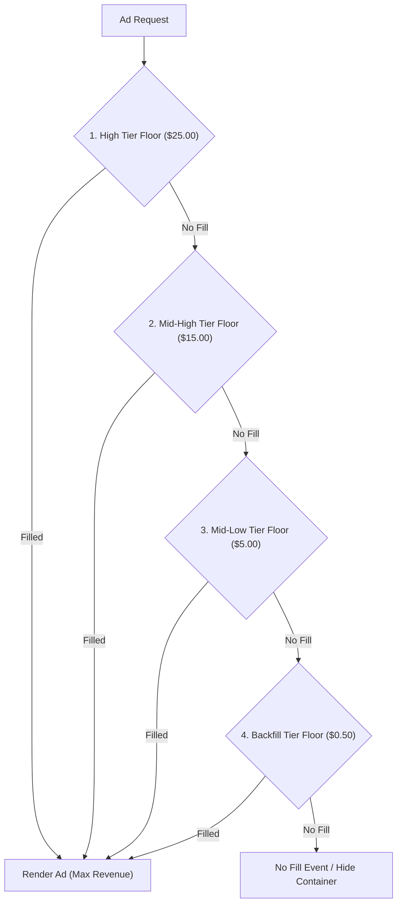
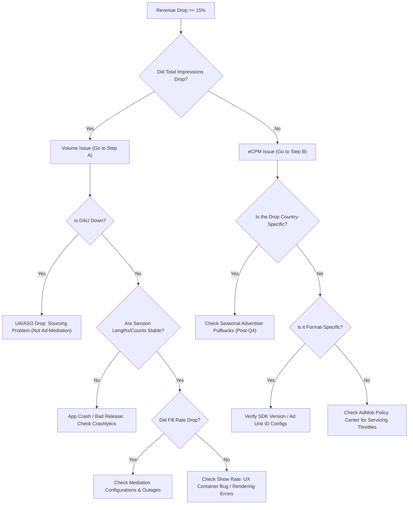

# AdMob & Mediation Monetization Playbook

This playbook establishes the core methodologies, configuration guides, and troubleshooting workflows for managing and optimizing Google AdMob and third-party ad mediation systems across the **KalaGato** application portfolio.

---

## 1. Key Performance Indicators (KPIs)

Our ad monetization success relies on five main metrics:

1. **eCPM (Effective Cost Per Mille)**: The revenue generated per 1,000 ad impressions. This is heavily driven by user geographic location, ad formats, and bid density.
2. **Fill Rate**: The percentage of ad requests that are successfully served with an ad. Target baseline: **≥75%**.
3. **Show Rate (Render Rate)**: The percentage of loaded ads that are actually rendered to the user. High match rates with low show rates point to integration or UX bugs.
4. **ARPDAU (Average Revenue Per Daily Active User)**: Calculated as:
   $$\text{ARPDAU} = \text{Impressions per User} \times \frac{\text{eCPM}}{1000}$$
   This is our primary metric for evaluating monetization health as it normalizes for DAU fluctuations.
5. **Retention (D1 / D7 / D30)**: Monetization must never be optimized at the cost of core user retention. Low retention ultimately degrades DAU and long-term revenue.

---

## 2. eCPM Optimization & Waterfall Strategies

To maximize revenue, our monetization team uses a combination of SDK bidding and structured multi-floor price ladders:

### Multi-Floor Waterfall Price Ladders
For ad networks that do not support unified real-time bidding, we implement a multi-floor "price ladder" to extract maximum yield per impression:

### eCPM Optimization Levers
* **Maximize Bidding Networks**: Ensure that every demand partner supporting real-time bidding is configured in bidding mode. Waterfall-only setups are suboptimal and increase latency.
* **Ad Format Optimization**:
  * Prioritize **Rewarded Ads** and **Rewarded Interstitials** where possible. These yield the highest eCPMs and exhibit strong user acceptance.
  * Implement **Adaptive Banners** instead of standard fixed-size banners. This typically provides a **15% to 30%** eCPM uplift.
  * Integrate **App Open Ads** to monetize cold-start sessions without adding intrusive mid-session interruptions.
* **Geographical Calibration**: Adjust ad frequencies and price floor ladders based on regional eCPM tiers. US, UK, and Western European traffic can support higher floor tiers, whereas lower-eCPM regions require deeper backfill chains.

---

## 3. Revenue Drop Investigation Workflow

When a daily revenue drop of **≥15%** is detected relative to the trailing 7-day average, the PM and Monetization Lead must execute the following diagnostic tree:

---

## 4. Fill Rate & Integration Troubleshooting

Use this table to diagnose and resolve fill rate issues:

| Symptom | Likely Root Cause | Diagnostic Steps | Mitigation Action |
| :--- | :--- | :--- | :--- |
| **0% Fill Rate on specific Ad Unit** | Misconfigured Ad Unit ID, account ban, or inactive unit. | Check AdMob Policy Center; verify Ad Unit status in console. | Correct ID configurations or appeal policy infraction. |
| **Sudden Fill Rate drop after update** | SDK mismatch, broken container layouts, or missing runtime permissions. | Segment fill rate by application version. | Roll back store version or hotfix the SDK initialization code. |
| **Low Fill Rate in specific Geos** | Excessive price floors in low-demand regional markets. | Compare fill rate by country. | Lower floor values for low-demand regions or add regional backfill partners. |
| **Match Rate high, but Fill/Show Rate low** | Ad container failed to render or was hidden below the fold. | Review show rate metrics in the console. | Fix UI container bounds and pre-cache ads before trigger events. |
