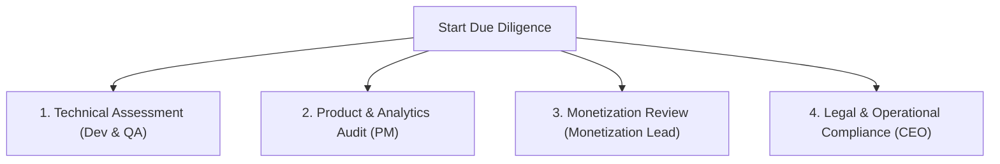

# M&A Due Diligence & Pipeline Audits

This document establishes the comprehensive standard operating procedures (SOP) for sourcing, evaluating, and conducting technical and operational due diligence (DD) on target mobile applications for acquisition by **KalaGato**.

---

## 1. M&A Strategy & Sourcing Thesis

KalaGato deploys a highly disciplined capital allocation strategy focused on acquiring profitable utility, security, and entertainment applications.

* **Target Valuation Multiple**: We aggressively target acquisitions at an attractive blended multiple of **1.52x trailing 12-month net profits**.
* **Capital Pool**: Annual deployment of **$500,000+** to acquire stable mobile assets.
* **Vertical Alignment**: Sourced applications must fit into our key core verticals:
  * *Security & Privacy* (VPNs, device trackers, anti-theft utilities)
  * *Entertainment & Audio* (voice converters, audio modulators, casual shooters)
  * *Utility & Productivity Tools* (regional translators, financial calculators, educational tools)

---

## 2. Pre-Acquisition Sourcing & Pipeline Validation

Before moving an app to full due diligence, the M&A Analyst and PM must validate the initial pipeline parameters:
1. **Financial Verification**: Request and review certified merchant reports or ad console dashboards showing the past 12 months of revenue. Identify residual income models.
2. **Growth vs. Decay Rates**: Analyze user acquisition trends from the deal sheet to verify if installs and DAUs are stable, growing, or declining.
3. **Regional Demographics**: Segment traffic by country. Ensure that a significant portion of active users reside in high-eCPM regions (US, UK, Western Europe).

---

## 3. Four-Tier Technical & Operational Due Diligence

Once an app passes preliminary validation, the Tech and Product teams conduct a deep-dive due diligence assessment across four core dimensions:

### 3.1 Technical Assessment (Engineering & QA)
We require read-only repository access to evaluate codebase maintainability:

* **Android / iOS Code Quality**:
  * Verify target SDK (must compile against Android 34/35 or iOS 17/18).
  * Identify deprecated libraries, APIs, and obsolete SDK versions (e.g., outdated Unity or payment libraries).
  * Inspect code architecture (MVVM/MVC) and assess refactoring efforts. Check for standard obfuscation and ProGuard configs.
  * Audit build logs, crash rates (must have a crash-free session rate ≥99.5%), and memory footprint.
* **Backend & Infrastructure**:
  * Review high-level design (HLD) and low-level design (LLD) documents.
  * Audit server providers (AWS, Digital Ocean), runtime frameworks (PHP/Node version support), and cron job architectures.
  * Inspect database scaling, data caching, replication strategies, and server performance under simulated loads.
* **QA & Test Suite**:
  * Request existing regression test cases and check for automated testing framework coverage.

### 3.2 Product & Analytics Audit
The Product Manager must audit the target app's user journey and analytical integration:
* **Firebase Verification**: Cross-reference Google Play Console statistics with Firebase dashboard metrics to validate DAUs, MAUs, retention profiles (Day-1, Day-7, Day-30), and uninstall counts.
* **Feature Capabilities**: Map each application feature to its corresponding user actions and database entries.
* **App Console Health**: Verify Google Play Console and App Store Connect dashboard status. Check for legacy store strikes, policy violations, or developer account suspensions.

### 3.3 Monetization & Advertising Audit
The Monetization Lead audits the primary revenue streams:
* **Mediation Audit**: Request historic ad network reports down to the ad-unit level. Audit eCPM ranges, fill rates, and impressions per user by format (banner, interstitial, rewarded video).
* **Billing Systems**: Inspect in-app purchases (IAP) and subscription integrations (Adapty, RevenueCat, AppHUD). Review recurring billing cycles and refund policies.
* **Ad Quality Compliance**: Review ad density and placement schemes to ensure they conform to Google Play and Apple developer policies (e.g., no ads immediately after button taps, no accidental click baiting).

### 3.4 Legal & Operational Compliance
The Founder & CEO verifies all regulatory and contract matrices:
* **Intellectual Property (IP)**: Verify absolute ownership of all codebase elements, app names, domains, and design systems.
* **Privacy Compliance**: Ensure the app's privacy policy and data collection protocols comply with regional regulations (GDPR, CCPA).
* **Operational Transition**: Understand vendor partnerships, customer support workflows, and assess if key seller personnel are required during the Knowledge Transfer (KT) phase.
