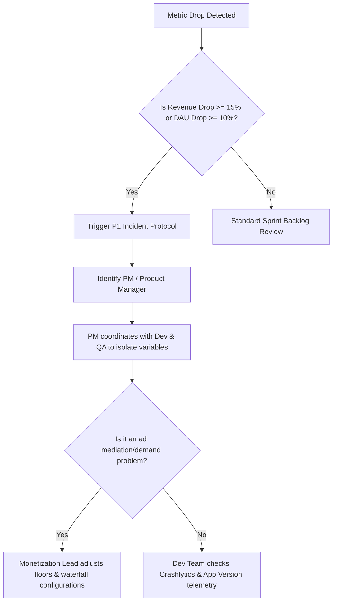

# Incident Management & Escalation SOP

This document outlines the standard operating procedures (SOP) for identifying, responding to, and resolving technical or operational incidents across the KalaGato application portfolio.

---

## 1. Incident Severity Classification

We classify production incidents into three clear severity levels based on business impact:

| Severity | Description | Target Response | Escalation Channel |
| :--- | :--- | :--- | :--- |
| **P0 (Critical)** | Core app crash, billing outage, key ad SDK break, or domain suspension affecting global traffic. | **Immediate (within 15m)** | Slack Alert, Emergency Phone Calls |
| **P1 (High)** | Severe metric drops (revenue down ≥15%, DAU drop ≥10%) or high-frequency functional bugs. | **Within 2 hours** | Slack Alert, Direct PM Notification |
| **P2 (Medium)** | Low-priority bugs, minor visual glitches, or non-blocking performance issues. | **Next Sprint Cycle** | Standard Jira Ticket creation |

---

## 2. Notification & Communication Channels

To coordinate our lean team efficiently, we establish dedicated pathways for incident reports:

### Slack Channels Directory
* **`#incident-response`**: Reserved exclusively for active P0/P1 incidents, live debugging status, and rollback logs.
* **`#app-reviews`**: Continuous monitoring channel where app store reviews and ratings are triaged.
* **`#monetization-alerts`**: System alerts for ad floor changes, fill rate issues, or RevenueCat transaction anomalies.

### Phone Escalation Protocol
If a P0 incident is identified outside of standard business hours, the team must initiate phone call escalations in the following order:
1. **Assigned Platform Developer** (Android/iOS)
2. **Product Manager / App Owner**
3. **Technical Lead / CTO**
4. **Founder & CEO** *(if unresolved within 60 minutes)*

---

## 3. Metric Drop Investigations

Sudden drops in performance require immediate cross-functional investigation:

---

## 4. Emergency Hotfix Release Flow

When a hotfix is required to address a critical P0 production issue:

1. **Jira Synchronization**: An emergency hotfix ticket must be created in Jira. The branch name in GitHub must match the Jira ticket number exactly (e.g., `feature/KG-102-hotfix-crash`).
2. **Strict Isolated Scope**: Hotfixes must only contain code changes directly resolving the incident. Do not bundle pending sprint features into an emergency hotfix build.
3. **QA Guardrails**: The QA team must run a regression pass on the affected feature, verify the fix on real staging devices, and check LeakCanary logs to ensure no new memory leaks are introduced.
4. **Product Team Approval**: Before compiling the final production store release, the developer must demo the fix to the PM and get explicit approval.

---

## 5. Rollback Procedures & Staged Rollouts

To protect our massive global user base, all updates must follow a staged rollout:

* **Rollout Schedule**: Initiate the update at **1%** -> **10%** -> **50%** -> **100%**.
* **Rollback Triggers**: If a release exhibits a crash-free rate below **99.5%**, causes immediate fill-rate anomalies, or generates severe user review trends, the rollout must be halted immediately.
* **Halted Release SOP**:
  * Formalize the rollback action in the `#incident-response` Slack channel.
  * Halt the staged release in the Google Play Console / App Store Connect.
  * Provide a detailed incident summary (blocker bugs, version details, diagnostic metrics) and pin it to the parent PRD in Notion.
