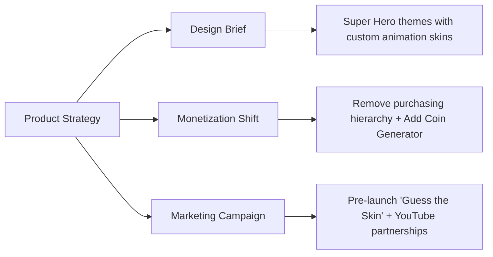

# PRD Writing Guide & Release Case Study

This document provides our step-by-step guide for writing **Product Requirement Documents (PRDs)** at **KalaGato**, paired with an institutional case study detailing the successful **Clone Armies Super Hero Skin Pack Release**.

---

## 1. Product Requirement Document (PRD) Standards

At KalaGato, the PRD is the absolute source of truth for all departments. Every feature or product update must begin with a structured PRD.

### Core PRD Requirements
Every PRD must include these seven key sections:
1. **Primary Metric Identification**: Align the release under one of five business targets: *Retention/Attrition, Engagement, User Growth, Stability, or Monetization*.
2. **Quantitative Target**: Establish a clear target value for the primary metric.
3. **Concise Problem Statement**: Describe the user pain point or business opportunity.
4. **Cross-Functional Briefs**:
   * *Design*: UX requirements, visual guidelines, Figma links, and ad unit placement guidelines.
   * *Marketing*: Campaign schedules, push notification copies, and app store metadata updates.
   * *Monetization*: Entitlements mapping, subscription configurations, and mediation waterfall rules.
5. **Technical Specifications**: Frontend and backend requirements, analytics event parameters (Firebase/Superwall/RevenueCat), and third-party API dependencies.
6. **Acceptance Criteria**: Strict binary rules to determine if a feature is ready.
7. **Rollback & Support Plan**: Steps to undo the release if key metrics degrade.

---

## 2. Institutional Case Study: Clone Armies Skin Pack

This case study illustrates how our standard PRD methodology was applied to resolve an engagement and revenue bottleneck in **Clone Armies**.

### 2.1 The Challenge
* **Context**: The game experienced a gradual decline in user engagement over a 6-month period, leading to an all-time low of **393,285 active users** and monthly revenue of **$8,082**.
* **Diagnosis**: Deep data analysis revealed the game economy was imbalanced, player retention was slipping, and the existing store model had excessive buy barriers.
* **Release Metric Targets**:
  * **Primary Metric**: Reduction in churn rate from **70% to 35%**.
  * **Secondary Metric**: Growth in monthly revenue to a target of **$20,000/month**.

---

### 2.2 The Strategy & Multi-Disciplinary Briefs

To resolve the challenge, the PM structured the following coordinated release plan:

#### Design Brief
* **Asset Creation**: Michael was commissioned to design custom, superhero-themed visual skins featuring moving parts and neon styling for each unit in the game, including two hidden units that had never had custom layouts before.
* **Budget**: $1,000
* **Timeline**: 4 weeks (July 1 to July 28)

#### Monetization & Economy Design
* **Store Optimization**: Removed the strict purchase hierarchy in the in-game shop, allowing players to purchase high-tier skin packs and capsule offers directly.
* **Utility Addition**: Introduced a new **Coin Generator** feature to give active players reliable paths to earn in-game currency, balancing the purchase dynamics.

#### Marketing & Campaign Brief
* **Pre-Launch**: Initiated a "Guess the Skin" event on active social media channels and game forums to build anticipation.
* **Post-Launch**:
  * Partnered with YouTube gaming creators by provisioning free in-game reward packages for their communities.
  * Triggered custom in-app push notifications showcasing the Superhero skins.
  * Updated ASO store listing graphics with the new designs.
* **Timeline**: Aug 29 to Oct 15

---

### 2.3 Technical Specs, QA, & Outcomes

#### Technical Execution
* **Frontend**: Integrated the Superhero skin libraries, updated the shop layout to remove buy hierarchies, and resolved skin display latency bugs to prepare for future updates.
* **Analytics Event Schema**: Programmed event dispatch trackers on key metrics, including:
  * Number of players using DNA upgrades.
  * Total play duration (`TotalTimePlayedMS`) and mission completions (`missionCompleted`).
  * Win rates per game unit.
  * Active clicks on store items.

#### Quality Assurance Test Cases
QA verified the update using specific scenarios:
1. Confirm that Superhero skins display error-free in the catalog and are visible to other players in multiplayer matches.
2. Confirm that skin selection does not trigger performance hits, screen lag, or visual glitches.
3. Verify that players can purchase the skins with in-game currency or real-money transactions.
4. Verify the rollback process by running pre-release beta builds to ensure the stable baseline version is restorable.

#### Key Outcomes
By applying this systematic approach, the Superhero update successfully met its target goals, increasing engagement metrics, balancing the in-game economy, and recovering revenue trends.
