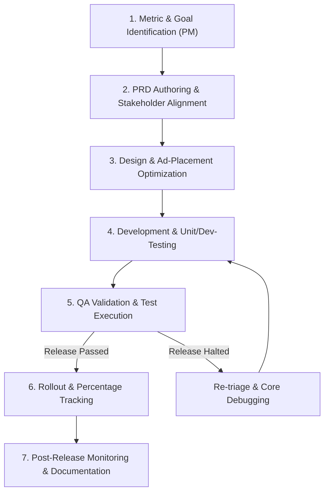

# Standard Operating Procedure (SOP) for Release

This document outlines the end-to-end, cross-functional release process at KalaGato. It serves as our structured roadmap for shipping app updates, bug fixes, and new features across all active products. Every department is held accountable to this lifecycle to ensure that we maintain high product stability, excellent store ratings, and maximized revenue.

---

## Release Lifecycle Overview

Our release process is divided into seven clear phases, driven by collaboration between the Product, Design, Engineering, Marketing, Monetization, and QA teams.

---

## 1. Product Owner (PM) Responsibilities

The Product Manager is the primary driver of the release cycle and owns the **Product Requirement Document (PRD)** end-to-end.

### Metric Identification & Intent
Before any work begins, the PM must define the exact purpose of the release:
1. **Identify Key Release Metric**: Determine the primary driver (e.g., *Attrition/Churn reduction, Engagement boost, User Growth, Stability & Maintenance, Revenue optimization, or Cost Reduction*).
2. **Define Secondary Metrics**: Outline key supporting metrics that will be observed (e.g., tracking uninstall rate while releasing a new paywall flow).
3. **Intent Documentation**: Formally state the problem statement and business hypothesis in Notion.

### PRD Structure Requirements
The PRD is the absolute source of truth for all departments. It must include:
* **Cost Analysis**: Estimated financial expenses including development hours, marketing/promotional costs, and infrastructure impacts.
* ** briefs**: Dedicated briefs for **Design**, **Marketing**, and **Monetization** details.
* **Technical Details**: Direct specifications outlining Frontend, Backend, and third-party integrations.
* **Analytics Tracking**: Specific event tracking requirements (Firebase, RevenueCat) for the new feature.
* **Acceptance Criteria**: Strict, binary conditions that determine if the feature is functional.
* **Risk & Impact Analysis**: Review of how this release affects other features, legacy versions, and systems.
* **Rollback & Support Plan**: Detailed steps for emergency rollbacks and support documentation for customer triage.
* **Review Scenarios**: Anticipated positive and negative user store review scenarios and prepared support templates.

### Stakeholder Alignment & Jira Setup
* **Tagging Stakeholders**: The PM must tag specific department owners in the PRD and corresponding Jira tickets.
* **Timeline Mapping**: Establish explicit start and completion target dates following the JIRA naming taxonomy.
* **Pre-Release Sync**: Host a brief alignment review with relevant teams (Design, Dev, Marketing, QA, Monetization) before coding starts.

---

## 2. Design Team Responsibilities

The design team builds intuitive user interfaces while protecting brand identity and optimization metrics.

### The Design Brief
All design tasks are initiated via a structured brief in Jira containing:
* **Project Overview & Goals**: Strategic outcomes defined by the PM.
* **User Research & Behavior**: Metrics and findings on current user flow friction.
* **Brand Guidelines**: Design system parameters specific to the application.
* **Jira Mapping**: Clear deadlines and subtask lists in the active sprint boards.

### Design Execution & Principles
1. **Navigation & Simplicity**: Build intuitive, clean, clutter-free layouts to improve overall conversion.
2. **Visual Styling**: Style layouts to visually engage the specific target audience.
3. **Cross-Team Collaboration**:
 * Work directly with **Marketing** to optimize app store screenshots and creative assets.
 * Coordinate with **Monetization** to refine ad unit positions, sizes, and styling to prevent accidental clicks or user fatigue.

---

## 3. Development Team Responsibilities

Engineering translates design assets and PRD specifications into stable, highly performant production code.

### Jira Workflow & Module Tasks
* Create distinct Jira tasks for individual software modules.
* Assign tasks to the respective platform engineers (iOS / Android / Backend) and keep state updates current.

### Code Quality & Testing Guards
1. **Unit Testing**: Implement unit test cases inside the codebase. These cases must be validated by the Tech Lead or QA Head before merge.
2. **Dev-Testing**: Complete robust development testing before handoff to QA. Create and pin a concise *Dev-Test Summary* doc to the Jira ticket.
3. **Code Optimization**:
 * Integrate standard optimizers (**ProGuard**, **R8**, etc.) to decrease final binary size and secure the code.
 * Perform security measures to prevent reverse engineering.

### Debugging Integration (Non-Release Builds Only)
To accelerate debugging and prevent performance leaks, debug builds must include:
* **Facebook Flipper**: For live inspection of crashes, memory leaks, networking requests, and local logs. *(Must be excluded from release configurations).* * **LeakCanary**: For active memory leak identification. *(Must be excluded from release configurations).* ---

## 4. QA & Testing Team Responsibilities

The QA team is the final gatekeeper of product quality before public store compilation.

### Test Case Planning
* Collaborate with the PM and Tech Lead to write extensive functional, performance, security, and user acceptance test cases.
* Attach these test scripts directly to the parent release ticket in Jira.

### Execution & Automation
1. **Release Handoff Testing**: Validate developer test logs and compile build logs.
2. **Automated Stress Testing**: Utilize automation platforms such as **MonkeyRun** and regional **Ads Violation Checkers** to verify app stability.
3. **Diagnostics Review**: Actively monitor for ANRs (App Not Responding) and crash reports.

### The Release Gate
At the end of testing, the QA team must declare one of two final states:
* **Release Halted**: Provide a detailed document outlining the blocker bugs, version constraints, and impact metrics. Pin this report to the PRD and update the Jira status.
* **Release Passed**: Author a release summary documenting targets achieved, execution time, and testing iterations before store staging.

---

## 5. Marketing Team Responsibilities

The marketing team drives user acquisition, store listing optimization, and re-engagement campaigns.

### Campaign Timelines & Performance Tracking
* Align promotional assets with the release schedule.
* Map and assign marketing sprint tickets in Jira with clear completion dates.

### Retention & Re-Engagement Execution
* **Dormant User Strategy**: Schedule re-engagement push notifications (PNs) and in-app communications at standard intervals (Day 30, Day 60, Day 90, and 6 months).
* **Active Monitoring**: Review Firebase data to track user drops, screen duration, uninstall flags, and new feature click rates. Stitch these live performance indices onto corresponding Jira tickets.
* **Efficacy Tracking**: Measure and report Return on Ad Spend (RoAS) and marketing channel efficacy.

### User Acquisition & Localization
* Maintain active App Store Optimization (ASO) updates based on geographic trends.
* Create localization assets for global target regions.
* Manage paid ad channels (Google, Apple) and establish budget plans to avoid organic traffic cannibalization.

---

## 6. Monetization Team Responsibilities

The monetization team oversees the revenue engines, ad floor pricing, and paywall conversions.

### Strategic Review & Timelines
* Align monetization tickets on the basis of PRD briefs.
* Manage floor pricing setups and RevenueCat/Superwall configurations.

### Metric Health Monitoring
1. **Engagement & User Growth**: General oversight to ensure ad networks are performant.
2. **Active Monetization Analysis**: Continuously evaluate paywall conversion rates, average revenue per paying user (ARPPU), and ad floor performance.
3. **Documentation**: Pin diagnostic findings, pricing audits, and floor modifications to the release's Jira epic.

---

## 7. Rollout, Percentage Tracking, & Continuous Improvement

Once a release has passed QA:
* **Staged Rollout Email**: The PM must formally email all stakeholders outlining the rollout percentage progression plan (e.g., 1% -> 10% -> 50% -> 100%).
* **Post-Release Monitoring**: Monitor performance closely at each stage using crashlytics, store consoles, and ad dashboards.
* **Continuous Improvement**: Conduct post-mortem reviews on past releases to improve next-sprint efficiency and refine our hygiene checklists.
