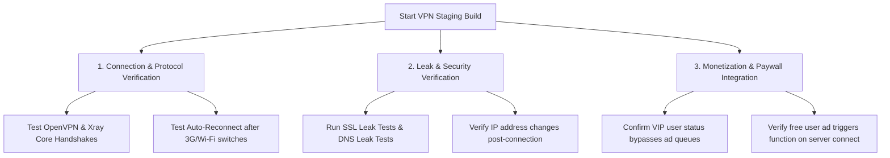

# QA Testing Checklists & Verification SOP

This document establishes the official QA test cases, pre-release testing checklists, and platform-specific verification procedures for applications across the **KalaGato** portfolio.

---

## 1. Pre-Release Core Hygiene Checklist

Every application release compilation—whether for a minor hotfix or a major feature update—must pass the following general hygiene checks before store deployment:

* **Upgrade & Migration Guardrails**:
  * Verify that existing users can update the app from the live store version to the new candidate build without losing local databases, active settings, or cached offline content.
  * Verify that forced migration and forced update flags (remote configurations) fire correctly.
* **Diagnostics & Obfuscation Verification**:
  * Verify that **ProGuard** or **R8** obfuscation rules are active and that no secure codebase strings are visible in decompiled binaries.
  * Ensure debug tooling (**Flipper**, **LeakCanary**) is completely stripped from release candidate configurations.
  * Check Sentry/Crashlytics SDK event dispatches.
* **Store Listing Assets & Metadata**:
  * Confirm privacy policy URLs are active on the store listing details page.
  * Verify store metadata, localized descriptions, and visual creatives match approved specifications.
* **Payment & Subscriptions Verification**:
  * Complete full sandbox purchase and cancellation test runs to ensure that entitlements are provisioned immediately and expire correctly without memory or thread locks.

---

## 2. Ryn VPN Pre-Release Checklist

For our secure tunnel utility suite (**Ryn VPN** & **Fast VPN**), QA must perform specialized networking tests:

### 2.1 Connection and Stability Testing
1. **Multi-Protocol Handshakes**: Verify successful VPN connection handshakes across all available protocols (OpenVPN, Xray, custom secure tunnels).
2. **Network Resilience**: Force network transition events (switching from high-speed Wi-Fi to a throttled 3G cellular network) and verify the VPN core reconnects gracefully within **5 seconds** without dropping packet protection.
3. **Always-On Integrity**: Verify the VPN kill-switch feature cleanly isolates device internet access if the proxy server connection is suddenly disrupted.

### 2.2 Leak and Security Inspections
1. **IP and DNS Verification**: Connect the app to a target region proxy, execute IP lookups, and verify the device's public IP address correctly displays the remote country. Run explicit DNS leak tests.
2. **Traffic Decryption**: Route device traffic through Charles Proxy or a packet capture tool. Verify that all payload data transmitted through the active tunnel is encrypted.

---

## 3. General Utility & IAP Checklists (Bank Balance / GST)

For utility applications (e.g., **GST Calculator**, **Age Calculator**, and finance utilities):

### 3.1 Core Usability & Formula Checkpoints
1. **Mathematical Accuracy**: Verify all financial calculations (GST, interest margins, age differences) are executed using high-precision data types. Compare output values against standard web tables.
2. **Offline Capabilities**: Confirm that the core calculator logic and locally cached utility features are fully functional when the test device has no cellular or Wi-Fi connectivity.
3. **Settings Persistence**: Verify that user-defined configurations (selected tax slabs, currency settings, preferred theme modes) remain saved after the app is hard-closed and restarted.

### 3.2 In-App Purchasing (IAP) & Ad Density Safeguards
1. **Banish Ad Overlaps**: Verify that banner ads, native ad units, or interstitials do not overlap with buttons or input fields on smaller screen devices.
2. **Mediation Ad Density**: Audit the ad flow frequency. Confirm that interstitial triggers align with product specifications and do not fire consecutively or trigger policy warnings (e.g., no ads immediately after keyboard inputs).
3. **Entitlement Handover**: Ensure that users who purchase premium, ad-free tiers are instantly upgraded to VIP status, ads are immediately hidden, and this state persists across device restarts and cache clearances.
