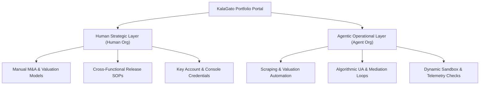

# Introduction

Welcome to the **KalaGato Documentation Hub**. This knowledge base serves as the definitive reference portal, operational playbook, and structural directory for **KalaGato (Human Data SG Pte. Ltd.)**. 

KalaGato scales a highly profitable portfolio of **15+ live mobile applications** across iOS and Android platforms, catering to millions of monthly active users globally. To govern this footprint efficiently at high margins, our operations are divided into two distinct, isolated layers:

---

## The Human Strategic Layer (Human Org)

The **Human Strategic Layer** contains the manuals, onboarding checklists, and Standard Operating Procedures (SOPs) executed by our real-world human team members. 

* **Elite Competencies**: Financial M&A modeling, asset acquisition sourcing (escrow verification), high-level product design, code audits, localized marketing campaigns, and ad network floor configuration reviews.
* **Operational Rhythms**: Monday Weekly Sync (10:00 AM), async daily standups in Jira/Slack, and active customer review triage in the `#app-reviews` Slack channel.
* **Approval Gates**: All major budgets (contracts > 10,000), single paid UA channel modifications (> $500/day), final code releases, and store staging configurations require human verification and manual approval.

 **[Go to the Human Strategic Layer Manuals](/docs/human_org)** ---

## The Agentic Operational Layer (Agent Org)

The **Agentic Operational Layer** is our telemetry and automated execution system. It maps the blueprints, loops, and micro-architectures that run continuous, machine-driven growth and health protocols across the portfolio.

* **Automation Frameworks**: Automated target scouting, real-time SDK crash telemetry logs, Superwall paywall testing hooks, CRM push notification schedulers, and mediation groups performance parsers.
* **Role Mappings**: Autonomous service pipelines structured as "agents" (ASO keyword analyzer, Mediation manager, Sandbox testing pipeline, UA balance tracker, etc.) that feed telemetry data directly to dashboard systems.

 **[Go to the Agentic Operational Layer Blueprint](/docs/agent_org)** ---

## 2026 Core Growth Targets

Every department and operational pipeline aligns around clear, quantitative milestones:

* **Revenue**: Scaling our run-rate from **$130,000 MRR** to **$300,000 MRR** by December 2026.
* **Profitability**: Maintaining elite portfolio-wide blended gross margins of **~90%**.
* **Capital Deployment**: Allocating **$500,000+** in M&A capital to acquire stable, profitable utility or entertainment apps at attractive **1.52x profit multiples**.
* **Organic Footprint**: Initiating automated video UGC (User Generated Content) campaigns to scale store conversion ratios globally.
