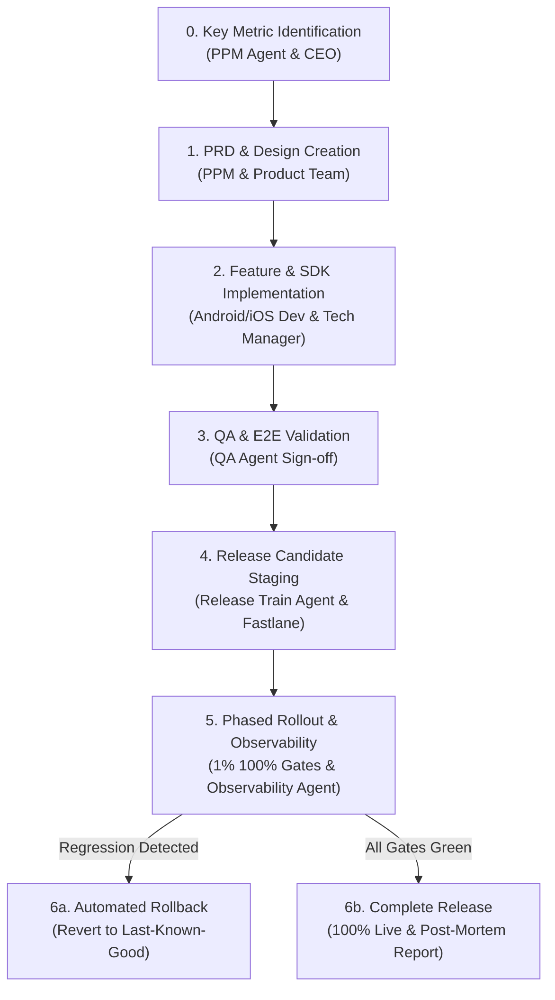
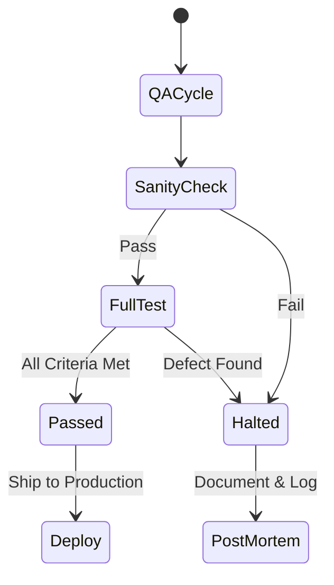

 # Standard Operating Procedure (SOP) for Releases

This Standard Operating Procedure (SOP) defines the systematic, metrics-driven release lifecycle for the KalaGato app portfolio. It establishes clear operational boundaries and structured workflows for all departments.

KalaGato manages a multi-tier portfolio of 15+ mobile applications. This SOP governs how features, updates, and optimizations are prepared, validated, and shipped to the Google Play Store and Apple App Store. The release train is managed by a combination of human strategic supervision (the CEO and CTO) and the **KalaGato Agentic Org** (Tech Manager, Growth Manager, Release Train Agent, and supporting worker agents).

---

## Release Lifecycle Overview

To maintain safety and continuous deployment velocity across 15+ applications, the release pipeline is structured as an automated, multi-tiered train governed by strict gating criteria.

---

## 1. Product Owner (Product Management) Workflow

The Product Owner (PM) is responsible for outlining the business strategy, defining the key metrics, and generating the core requirements.

### 1.1. Key Metric Identification
Every release must target and actively solve for a specific, primary strategic metric. We do not ship "general updates." PMs must classify each release under one of the following key focus areas:
* **Attrition / Churn:** Minimizing user leakage and stabilizing active usage (essential for apps like *Ryn VPN*).
* **Engagement:** Enhancing daily session durations, screen sessions, and active clicks.
* **User Growth:** Expanding top-of-funnel acquisition, invites, and organic multipliers.
* **Stability & Maintenance:** Resolving critical bugs, performing SDK upgrades, and addressing store compliance.
* **Revenue:** Driving in-app purchases, trial starts, paywall conversions, and mediating ad units.
* **Cost Reduction:** Optimizing backend APIs and reducing server dependencies.

### 1.2. PM Process Steps
1. **Identify the Metric to Improve:** Explicitly state which primary metric this release targets.
2. **Define Secondary Metrics:** Document secondary metrics along with the Key Release Metric wherever applicable.
3. **Document and State Intent:** Draft a clear statement of intent for the release.
4. **Stakeholder Communication:** PM should communicate the problem, align with the key metric, and share it with relevant stakeholders across Marketing, Development, Design, QA, ASO, and Monetization.
5. **Deliver PRD:** Communicate the chosen solution via a highly detailed Product Requirement Document (PRD).

### 1.3. PRD Structural Format
A standard KalaGato PRD must contain the following core sections:
* **Cost Analysis:** Exhaustive cost projection of the new feature including development, marketing, and promotional expenses.
* **Strategic Briefs:** * **Design Brief:** Visual goals, behaviors, and navigation changes.
 * **Marketing Brief:** ASO updates, communication plans, and budget allocation.
 * **Monetization Brief:** Ad units, placements, subscription gates, and pricing setups.
* **Execution Roadmap:** Detailed release timelines and step-by-step milestones.
* **Technical Details:** Frontend & Backend systems architectures, API changes, and schema updates.
* **Release Notes:** Multi-lingual descriptions for app store listings.
* **Analytics Tracking:** Exact event keys, schemas, triggers, and tracking properties.
* **Acceptance Criteria:** Strict behavioral definitions for when the feature is considered functionally complete.
* **Risk Assessment:** Analysis of regression risks, database load impacts, and security vectors.
* **Impact Analysis:** Evaluate potential impacts of the release on other integrated systems and operations.
* **Release Checklists:** Use hygiene checklists to ensure complete app control (e.g. force update/migrate configs) before deployment.
* **Support Documentation:** Explanatory copy and FAQ guides for the customer support team.
* **QA Test Integration:** PM coordinates with the QA team to write test cases based on the PRD (including API responses, ad policies, and guidelines). Ensure that ad-policy issues (such as displaying interstitials immediately after each tap) are strictly prevented.
* **Expected Review Vectors:** Document expected user response (for both positive and negative reviews) and map review metrics to the customer satisfaction (CX) sheet.
* **Rollback Strategy:** Clear step-by-step rollback execution plan in case of critical crash or conversion drops.

### 1.4. Operational Tasks
* **Stakeholder Tagging:** Identify and tag the respective stakeholders from each department, mapping their responsibilities on the JIRA ticket and PRD.
* **Taxonomy & Timelines:** Specify start and estimated completion dates in JIRA using official KalaGato JIRA Taxonomy.
* **Release Visibility:** Rollout release schedules and exact release percentages must be emailed to every stakeholder.
* **Post-Release Monitoring:** Actively observe real-time metrics and feed learnings back into the product cycle.
* **Continuous Improvement:** Use retrospect data and past post-mortems to iteratively improve future release pipelines.

---

## 2. Creative & Design Workflow

The Design Team aligns UI/UX elements with target metrics and provides visual assets to development and marketing units.

### 2.1. Design Brief format
Every design ticket must start with a comprehensive brief:
* **Project Overview:** A brief summary of the project goals.
* **User Research:** Summary of user research data compiled by the PM.
* **User Behavior Analysis:** Analysis of active user interactions on relevant screens.
* **Brand Guidelines:** App-specific style rules (colors, fonts, visual tone).
* **Design Requirements:** Concrete deliverables (Figma pages, asset exports, layouts).
* **JIRA Deadline:** Deadlines mapped and ticketed inside JIRA.

### 2.2. Design Process
1. **User Flow Review:** Review the user flow designed by the PM and provide structural improvements.
2. **Navigation Design:** Design smooth, frictionless, and intuitive navigation flows.
3. **Target Audience Appeal:** Develop a visual language tailored to target demographics.
4. **Visual Interface Design:** Draft modern high-fidelity screens emphasizing premium aesthetics.
5. **Simplicity & Consistency:** Keep the interface clean and clutter-free, reusing design system components.
6. **Marketing Collaborations:** Collaborate with the marketing team to design high-impact ad creatives and app store screens.
7. **Monetization Review:** Consult the monetization lead on asset placement to optimize ad viewability and paywall visibility.

---

## 3. Marketing & ASO Operations

Marketing drives growth, scales UA campaign spending, and maintains outer-loop customer communications.

### 3.1. Timelines and Tickets
* Timelines are aligned based on marketing briefs in the PRD.
* Corresponding JIRA tickets must be assigned to concerned team members with dates finalized by the Team Lead.

### 3.2. Strategic Campaigns by Metric Focus

#### A. Stability and Maintenance
* Develop user-facing messaging to communicate bug fixes and critical app stability updates.
* Distribute announcements via App Store/Play Store changelogs, automated emails, and in-app updates.

#### B. Engagement Strategy
* Track and catalog DAU (Daily Active Users) and MAU (Monthly Active Users).
* Design custom Push Notification (PN) matrices and in-app popups based on the PRD briefs.
* Execute re-engagement campaigns targeting dormant and returning users on structured intervals: **30 days, 60 days, 90 days, and 6 months**.
* Track app uninstall events, screen flows, click behaviors, and measure the ROI of in-app communications.
* Stitch performance metrics directly into JIRA tickets.

#### C. User Growth & Acquisition
* Deploy short-term (SD) and long-term (LD) growth strategies with customized creative suites.
* Optimize visitor-to-install conversions, localized by country.
* Execute ongoing App Store Optimization (ASO) updates to boost keyword ranks.
* Drive paid UA networks (Google Ads, Unity Ads) to capture high-intent users, managing CPI metrics to avoid organic cannibalization.

#### D. Revenue & Conversion
* Implement custom subscription drive schedules using push notifications and targeted in-app promotions.
* Execute price discounts and seasonal sale strategies.
* Audit campaign RoAS to verify marketing spend efficiency.

#### E. Retention
* Analyze retention behaviors beginning at day of install (T0).
* Coordinate with the design team on high-impact announcements for new features or major UI updates.
* Deploy user acquisition campaigns specifically optimized for retention-retaining properties.

### 3.3. Marketing Administration
* **Documentation:** Pin all findings, metrics reports, and UA outcomes inside the core JIRA issue.
* **Feedback Ingestion:** Gather real-time post-release user comments to build backlog enhancements.

---

## 4. Monetization Strategy

Monetization coordinates ad waterfalls, Remote Config paywalls, and audits post-release financial metrics.

### 4.1. Core Operations
* Align monetization setups and implementation timelines with the PRD.
* Create distinct JIRA tasks to trace ad units, mediation updates, and paywall adjustments.

### 4.2. Department Roles
* **Engagement Tracking:** Monitor baseline eCPMs and active conversion rates.
* **User Growth Support:** Calibrate bidding ceilings for ad waterfalls relative to acquisition volume.
* **Monetization Audits:** Continuously monitor and analyze monetization metrics to evaluate the effectiveness of monetization strategies and make improvements as necessary.
* **Retention Oversight:** Audit whether changes in ad frequencies or placement types trigger churn spikes.

### 4.3. Documentation
* Document ad waterfall structures, Superwall/RevenueCat testing setups, and pin metrics reports directly to the release ticket in JIRA.

---

## 5. Engineering & Development Lifecycle

Engineering designs clean, maintainable systems, ensures SDK stability, and ships optimized binaries.

### 5.1. Requirements & Tasking
1. **Requirements Gathering:** Open a specific JIRA ticket to compile and review the technical architecture requirements.
2. **Modular Development Tasks:** Generate individual JIRA subtasks for each component/module under development. Update code progress in real-time.

### 5.2. Testing and Validation Gating
* **Unit Testing:** Implement robust unit-tests within the codebase. The Head of Tech or Head of QA must audit test outcomes to verify code sanity.
* **Developer Testing (Sanity):** Complete dev-testing before releasing build to QA (devs can test it based on their own knowledge of product) and provide a doc on the same to the QA Team.

### 5.3. Debugging & Telemetry Tools
* **FP Flipper Integration:** Integrate the Flipper debugging tools into **debug builds only** for tracing network payloads, logs, and database records. Ensure Flipper is fully stripped from release binaries.
* **LeakCanary Integration:** Implement LeakCanary in testing builds to capture memory leaks and reference trees.
* **Code Optimizers:** Configure ProGuard/R8 rules to minify the binary, optimize code blocks, and prevent reverse engineering vectors.

---

## 6. Quality Assurance & Gating Rules

QA acts as the final gate, executing comprehensive test suites to ensure zero-defect deployments.

### 6.1. Test Case Development
* Create a specific JIRA task for test case development.
* Coordinate with the PM and engineering teams to write structured test cases based on the PRD (covering functional, performance, security, and UAT boundaries).

### 6.2. Execution & Safety Controls
* **Dev-Testing Reviews:** Sanity-check developer validation docs before starting test cycles. Open blocking tickets for developer bugs.
* **Automated Testing:** Run automated E2E pipelines using tools like **MonkeyRun** and **Ads Violation Checker**.
* **Telemetry Audits:** Continually watch for ANRs (App Not Responding) and unexpected background crashes.

### 6.3. Gate Governance

* **Release Halted:** If the release fails to meet QA standards:
 1. Provide a detailed explanation of the reasons for the halt.
 2. Document the reasons in the relevant PRD along with the version number.
 3. Update the JIRA task with the reasons for the halt.
* **Release Passed:** If the release meets all acceptance thresholds:
 1. Specify the target achieved, time taken, and number of test iterations.
 2. Update the JIRA task and mark the gate as **Passed**.

---

## 7. Human-Agent Hybrid Operational Mapping

To illustrate how departments and agents collaborate on the release train, the following table maps the human owners, their automated counterparts, and the JIRA tracking expectations:

| Phase | Human Owner | Agent Counterpart | JIRA Tracking Expectation | Key Metric Focus |
| :--- | :--- | :--- | :--- | :--- |
| **0. Planning** | Founder & CEO | PPM Agent | Requirement JIRA Task created & Key Metric set. | Strategy Calibration |
| **1. Briefing** | PM Team | Chief of Staff Agent | PRD pinned with Cost & Risk briefs. | Scope Definition |
| **2. Designing** | UX Design Team | Design Agent | Design Brief JIRA task, Figma layouts linked. | Visual Flow & UX |
| **3. Coding** | CTO & Developers | Tech Manager | Modular Dev JIRA tasks with unit-test summaries. | System Architecture |
| **4. Testing** | QA Team | QA Agent | Test Case Development task with E2E outcomes. | Build Integrity |
| **5. Deploying** | DevOps Lead | Release Train Agent | Release Track percentage & rollout approvals. | Release Staging |
| **6. Monitoring** | PM & Growth | Observability Agent | Real-time crash reports & conversion logs. | Release Acceptance |
